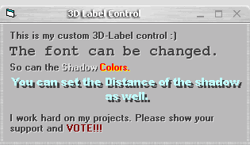



## \_ 3D Label Control

### Description

3D Label Control. Easy to use. Can change appearance. (Raised, Inset, Emboss, Color(s), etc.) See screen shot and PLEASE VOTE!
 
### More Info
 

             |
---                |---
**Submitted On**   |2003-12-04 15:21:44
**By**             |[KRYO\_11](https://github.com/Planet-Source-Code/PSCIndex/blob/master/ByAuthor/kryo-11.md)
**Level**          |Intermediate
**User Rating**    |4.7 (123 globes from 26 users)
**Compatibility**  |VB 5\.0, VB 6\.0
**Category**       |[Custom Controls/ Forms/  Menus](https://github.com/Planet-Source-Code/PSCIndex/blob/master/ByCategory/custom-controls-forms-menus__1-4.md)
**World**          |[Visual Basic](https://github.com/Planet-Source-Code/PSCIndex/blob/master/ByWorld/visual-basic.md)
**Archive File**   |[\_\_3D\_Label1680311242003\.zip](https://github.com/Planet-Source-Code/kryo-11-3d-label-control__1-50318/archive/master.zip)

